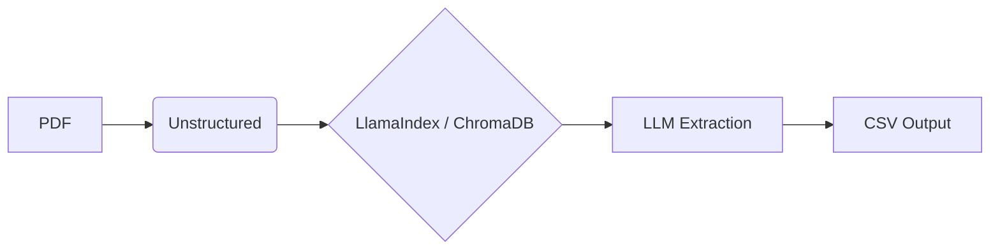

## Objetivo

Diseñar e implementar un pipeline modular de extracción de información capaz de procesar informes técnicos mineros extensos en formato PDF y transformar información no estructurada en datasets estructurados.  
El sistema construye un índice semántico del documento, extrae secciones clave (metadatos del proyecto, recursos minerales, reservas y variables económicas) mediante razonamiento asistido por modelos de lenguaje, y persiste los resultados en archivos CSV reproducibles, enriquecidos con metadatos de trazabilidad (fecha/hora y código del documento).
## 1. Inicialización del Entorno

Este proyecto utiliza **uv** como gestor de paquetes y entornos virtuales de Python por su velocidad y eficiencia.
### Instalación de uv

```bash
# En macOS/Linux
curl -LsSf https://astral.sh/uv/install.sh | sh

# En Windows (PowerShell)
powershell -c "irm https://astral.sh/uv/install.ps1 | iex"
```

### Configuración del proyecto

```bash
# Requisitos: Python 3.11+ # 3.12 estable

# Clonar el repositorio
git clone https://github.com/Juanmeve837/Test_DataEngineer2026.git
cd Test_DataEngineer2026

# Crear entorno virtual con uv
uv venv

# Activar el entorno virtual
# En Linux/macOS:
source .venv/bin/activate
# En Windows:
.venv\Scripts\activate

# Instalar dependencias si hay alguna dificultad
uv pip install .
```

## 2. Uso de GitHub Models

Se usa GitHub Models como playground de modelos LLM (Gratuito)

Se debe configurar manualmente la variable de entorno `GITHUB_TOKEN` con un [Personal Access Tokens (Classic)](https://github.com/settings/tokens) de GitHub. Puedes crear un PAT siguiendo estos pasos:

1. Ve a la configuración de tu cuenta de GitHub.
2. Haz clic en **“Developer settings”** en el menú lateral izquierdo.
3. Selecciona **“Personal access tokens”**.
4. Elige **“Tokens (classic)”** o **“Fine-grained tokens”**, según tu preferencia.
5. Haz clic en **“Generate new token”**.
6. Asigna un nombre al token y selecciona los permisos (scopes) que deseas otorgar.  
    Para este proyecto **no se requieren permisos específicos**.
7. Haz clic en **“Generate token”**.
8. Copia el token generado.

Finalmente, crear un archivo .env:

API_HOST=github

GITHUB_MODEL=gpt-4o

GITHUB_TOKEN=tu_token_de_github_aqui

modelos disponibles:  (*Nota: Se recomienda verificar la compatibilidad actual del modelo seleccionado con LlamaIndex)

- openai/gpt-4.1
- gpt-4o
- gpt-4o-mini
- mistral-ai/mistral-small-2503
- cohere/Cohere-command-r-08-2024
- Entre otros......

para mas modelos se puede revisar: https://github.com/marketplace?type=models

## 3. Ejecución

Para correr el pipeline de extracción sobre el PDF configurado:

```
# Ejecutar usando uv definir PDF_PATH para un solo expediente
uv run main_modular.py

# Ejecutar usando uv definir DATA_DIR para una carpeta de expedientes
uv run main_modular_batch.py
```

El script generará/actualizará los archivos CSV en la carpeta `output/`:

- `metadata.csv`
- `resources.csv`
- `reserves.csv`
- `economics.csv`

Para consolidar csv y data análisis 'data_analyst.ipynb' 

Contiene:

	- Consolidacion cvs -- `master_dataset.csv`
	- Información rescatada por expediente
	- Información rescatada por sección
	
### 3.1 Resultados	
#### 3.1.1 Información rescatada por expediente


#### 3.1.2 Información rescatada por sección


#### 3.1.3 Distribución del repositorio
```
proyecto/
├── data/                 # PDFs de entrada
├── src/                  # Módulos y lógica auxiliar
└──── .env.example        # Ejemplo Variables de entorno (no commitear)
├── output/               # Datos extraídos (CSV)
├── data_analyst.ipynb    # Analisis de la información recolectada
├── main_modular.py       # Script: Extracción individual
├── main_modular_batch.py # Script: Extracción por lotes
├── pyproject.toml        # Definición de dependencias (uv)
├── README.md             # Documentación

```

# 4. Stack Tecnológico y Decisiones de Diseño

| **Tecnología**             | **Rol**                 | **Por qué se eligió**                                                                                                                |
| -------------------------- | ----------------------- | ------------------------------------------------------------------------------------------------------------------------------------ |
| **LlamaIndex**             | Framework RAG           | Facilita la indexación de PDFs extensos y la recuperación de contexto (Retrieval) específico para cada sección del reporte.          |
| **GitHub Models (GPT-4o)** | LLM                     | Ofrece capacidad de razonamiento SOTA (State of the Art) accesible gratuitamente para prototipado rápido sin comprometer la calidad. |
| **Pydantic**               | Validación de Datos     | Crucial para forzar al LLM a devolver JSON estructurado y tipado (evitando alucinaciones de formato).                                |
| **Unstructured.io**        | Ingesta de Datos        | Supera a los lectores tradicionales al detectar mejor estructuras de tablas y particionar el documento de forma semántica.           |
| **Tenacity**               | Resiliencia             | Implementa lógica de reintento (_Retry_) robusta para manejar errores `429 Too Many Requests` sin detener el pipeline.               |
| **Pandas**                 | Manipulación de Datos   | Estándar de la industria para transformar los objetos extraídos en estructuras tabulares (CSV/Parquet).                              |
| **ChromaDB**               | Base de Datos Vectorial | Permite persistir los vectores localmente, reduciendo costos de computación y tiempo de ejecución.                                   |
## 4.1 Arquitectura de la Solución 

1. **Ingesta (Unstructured):** El PDF es procesado por `UnstructuredReader`, que separa texto, títulos y tablas. 
2. **Indexación (ChromaDB):** Los elementos se convierten en embeddings y se almacenan en una colección persistente en `./chroma_db`. 
3. **Recuperación (Retrieval):** Se realizan búsquedas semánticas específicas para cada sección (ej. "Tablas de Recursos Minerales"). 
4. **Extracción Estructurada:** El LLM procesa el contexto y lo mapea a modelos de Pydantic. 5. **Persistencia Final:** Los datos se anexan (Append) a archivos CSV con metadatos de auditoría (Timestamp y ID). 


## 5. Desafíos y Soluciones

### 5. 1. Alucinación de Estructuras (Listas vs. Objetos)

- **Desafío:** Al pedir "Recursos Minerales", el modelo tendía a devolver solo la primera categoría (Measured) ignorando las demás.
- **Solución:** Se implementaron "Clases Wrapper" (`MineralResourceList`) en Pydantic para obligar al modelo a iterar y extraer **todos** los ítems encontrados en la tabla.

### 5.2. Límites de API (Rate Limiting)

- **Desafío:** La extracción secuencial rápida disparaba errores `RateLimitError` de la API de GitHub.
- **Solución:** Implementación de un decorador de **Exponential Backoff** que espera progresivamente (4s, 8s, 16s...) antes de reintentar, garantizando la ejecución completa.
### 5.3. Contexto Diluido

- **Desafío:** Enviar todo el PDF en una sola consulta confundía al modelo entre "Reservas" y "Recursos".
- **Solución:** Diseño de un pipeline modular donde cada función utiliza un `QueryEngine` especializado con instrucciones de búsqueda acotadas a su dominio específico.

## 6. Limitaciones Actuales

1. **Tablas Complejas/Escaneadas:** Si el PDF es una imagen escaneada (sin capa de texto OCR), el motor vectorial actual no podrá leer los datos. Se requeriría un modelo multimodal (Vision).
2. **Dependencia de Palabras Clave:** La recuperación depende de que el reporte use terminología estándar (NI 43-101). Reportes con nomenclaturas exóticas podrían requerir ajuste de prompts.
3. **Persistencia Volátil:** El índice vectorial se reconstruye en memoria en cada ejecución.

## Propuesta de Producción (Escalando a 10,000+ PDFs)

Para transformar esta arquitectura en una solución empresarial a gran escala:

1. **Procesamiento Distribuido:** Utilizar **Unstructured-API** en contenedores Docker corriendo en **Kubernetes** para procesar miles de páginas por minuto en paralelo.

2. **Persistencia Centralizada:** Migrar ChromaDB local a un cluster de **Chroma Cloud** o **Pinecone** para acceso multi-usuario y escalabilidad horizontal.

3. **Lakehouse Integration:** En lugar de CSVs, escribir directamente en tablas de **Delta Lake** o **Iceberg** para permitir consultas SQL directas sobre los datos extraídos.

4. **Pipeline de Auditoría:** Implementar una interfaz humana (Human-in-the-loop) para revisar extracciones donde el LLM reporte una "confianza baja" (Confidence Score).

5. **Monitoreo de Deriva (Drift):** Usar herramientas como **Arize Phoenix** para monitorear la calidad de las respuestas y la latencia del sistema RAG.

### Arquitectura Integrada (Flujo Lógico)

1. **Ingesta:** S3 recibe el PDF $\rightarrow$ Dispara EventBridge.

2. **Orquestación:** Step Functions decide la ruta.

3. **Procesamiento:** Nodo en K8s usa Unstructured para extraer contenido y metadatos.

4. **Almacenamiento Dual:**

- **Texto/Embeddings** $\rightarrow$ Vector Database (Pinecone).
- **Tablas/Metadatos** $\rightarrow$ Lakehouse (Delta Lake).

5. **Control de Calidad:** Si el score es bajo $\rightarrow$ Intervención humana. Si no $\rightarrow$ El dato está disponible para Athena y LLMs.

6. **Monitoreo:**  Athena/Redshift

### Estimación de Costos por Hoja (USD)

| **Capa de Gasto**   | **Tecnología**            | **Costo Estm. por Hoja** | **Notas**                            |
| ------------------- | ------------------------- | ------------------------ | ------------------------------------ |
| **Extracción**      | Unstructured API (SaaS)   | **$0.030**               | Incluye OCR y limpieza de tablas.    |
| **Inteligencia**    | LLM (Metadata/Resumen)    | **$0.008**               | Basado en GPT-4o o Claude 3.5 Haiku. |
| **Embeddings**      | OpenAI text-embedding-3   | **$0.0001**              | Es casi despreciable por volumen.    |
| **Infraestructura** | AWS (S3, Lambda, Step F.) | **$0.002**               | Orquestación y almacenamiento base.  |
| **TOTAL BASE**      |                           | **$0.0401**              | **~$0.04 USD por hoja.**             |
**Autor:** Juan Fernando Mesa **Fecha:** Enero 2026
